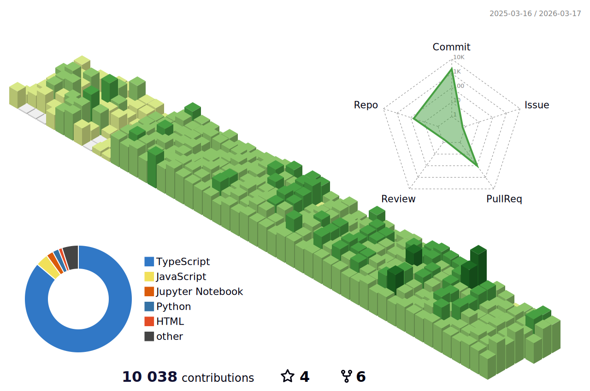

<h2> Connect With Me</h2>

<p align="center">
  <a href="mailto:bbhattarai770@gmail.com"></a>
  <a href="https://www.linkedin.com/in/bibekbhattarai14/"></a>
  <a href="https://discord.com/users/669517595975614490"> </a>
  <a href="https://github.com/bibek1414"> </a>
  <a href="https://www.instagram.com/bibekbhattarai14/"> </a>
</p>
<p align="center">
  <a href="mailto:manavkhadka0@gmail.com"></a>
  <a href="https://linkedin.com/in/manavkhadka0"></a>
  <a href="https://github.com/manavkhadka0"></a>
  <a href="https://twitter.com/manavkhadka0"></a>
</p>
<div align="center">
  
</div>

<h2> About Me</h2>

```javascript
const bibek = {
  location: "Kathmandu, Nepal 🇳🇵",
  education: {
    bachelor: "Computer Science and Information Technology (2024)",
    institution: "Hetauda City College",
    highSchool: "Science - Physics, Mathematics | Makwanpur Multiple Campus"
  },
  currentlyLearning: ["Machine Learning", "MLOps", "AWS Cloud Architecture"],
  askMeAbout: ["Web Dev", "App Dev", "DevOps", "Cloud Infrastructure", "System Design"],
  contactInfo: {
    email: "bbhattarai770@gmail.com",
    phone: "+977 9860425440",
    portfolio: "https://bibekbhattarai14.com.np"
  },
  currentFocus: "Building scalable applications with modern tech stacks and DevOps practices",
};
```

<div align="center">
  <a href="https://open.spotify.com/user/317pmqw3mrxsvootc53jy2bbolr4">
    
  </a>
</div>


<h2> Tech Stack</h2>

### 💻 Programming Languages
<p align="center">
 
  
</p>

### 🎨 Frontend Development
<p align="center">
    
</p>

### ⚙️ Backend Development
<p align="center">
 
  

</p>

### 🗄️ Databases
<p align="center">
    

</p>

### ☁️ Cloud & DevOps
<p align="center">

   

</p>

### 🤖 AI/ML & Data Science
<p align="center">

  

</p>

### 🛠️ Tools & IDEs
<p align="center">

  

</p>

### 📱 Mobile Development
<p align="center">

  
 
</p>

### 🎮 Game Development
<p align="center">
 
   
 
</p>

### 🖥️ Operating Systems
<p align="center">
 
  

</p>

### 🔧 Other Technologies
<p align="center">
 
  
  
</p>


<h2> Contribution Animations</h2>

<div align="center">
  <h3>🎮 Pacman eating my contributions</h3>
  <picture>
    <source media="(prefers-color-scheme: dark)" srcset="https://raw.githubusercontent.com/bibek1414/bibek1414/main/output/pacman-contribution-graph-dark.svg" />
    <source media="(prefers-color-scheme: light)" srcset="https://raw.githubusercontent.com/bibek1414/bibek1414/main/output/pacman-contribution-graph.svg" />
    
  </picture>
</div>

<br/>

<div align="center">
  <h3>🐍 Snake eating my contributions</h3>
  <picture>
    <source media="(prefers-color-scheme: dark)" srcset="https://raw.githubusercontent.com/bibek1414/bibek1414/main/output/snake-dark.svg">
    <source media="(prefers-color-scheme: light)" srcset="https://raw.githubusercontent.com/bibek1414/bibek1414/main/output/snake.svg">
    
  </picture>
</div>


<h2> GitHub Stats</h2>

<div align="center">
  
</div>

<div align="center">
  
  
</div>

<div align="center">
  
</div>

<div align="center">
  
</div>

<div align="center">
  
</div>

<div align="center">
  
</div>

<div align="center">
  
</div>
