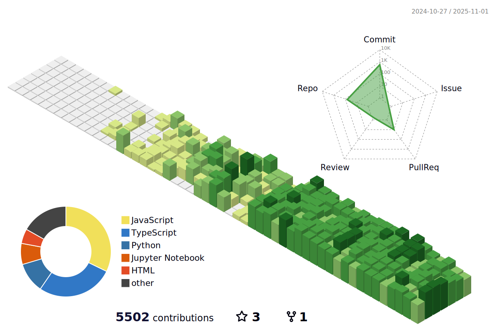

<h2> Connect With Me</h2>

<div align="center">

  <a href="mailto:bbhattarai770@gmail.com" target="_blank">
    
  </a>

  <a href="https://www.linkedin.com/in/bibekbhattarai14/" target="_blank">
    
  </a>

  <a href="https://discord.com/users/669517595975614490" target="_blank">
    
  </a>

  <a href="https://www.facebook.com/bibekbhattarai014" target="_blank">
    
  </a>

  <a href="https://www.instagram.com/bibekbhattarai14/" target="_blank">
    
  </a>

  <a href="https://medium.com/@bbhattarai770" target="_blank">
    
  </a>


  <a href="tel:+9779860425440" target="_blank">
    
  </a>

</div>


<div align="center">
  
</div>

<h2> About Me</h2>

```javascript
const bibek = {
  location: "Kathmandu, Nepal 🇳🇵",
  education: {
    bachelor: "Computer Science and Information Technology (2024)",
    institution: "Hetauda City College",
    highSchool: "Science - Physics, Mathematics | Makwanpur Multiple Campus"
  },
  currentlyLearning: ["Machine Learning", "MLOps", "AWS Cloud Architecture"],
  askMeAbout: ["Web Dev", "App Dev", "DevOps", "Cloud Infrastructure", "System Design"],
  contactInfo: {
    email: "bbhattarai770@gmail.com",
    phone: "+977 9860425440",
    portfolio: "https://bibekbhattarai14.com.np"
  },
  technologies: {
    frontEnd: {
      languages: ["HTML", "CSS", "JavaScript", "TypeScript"],
      frameworks: ["React", "Next.js", "Tailwind CSS"],
      libraries: ["GSAP", "AOS", "React Query", "Redux Toolkit"]
    },
    backEnd: {
      languages: ["Python", "Node.js"],
      frameworks: ["Django", "FastAPI", "Express"],
      tools: ["REST APIs"]
    },
    databases: ["MongoDB", "PostgreSQL", "MySQL"],
    dataScience: ["NumPy", "Pandas", "Scikit-Learn", "TensorFlow", "PyTorch", "Keras"],
    devOps: ["Linux", "Git", "Docker", "Kubernetes", "CI/CD Pipelines", "AWS", "Vercel"],
  },
  currentFocus: "Building scalable applications with modern tech stacks and DevOps practices",
};
```
<div align="center">
  <a href="https://open.spotify.com/user/317pmqw3mrxsvootc53jy2bbolr4">
    
  </a>
</div>
</img>

<h2> Contribution Animations</h2>

<!-- Pacman Animation -->
<div align="center">
  <h3>🎮 Pacman eating my contributions</h3>
  <picture>
    <source media="(prefers-color-scheme: dark)" srcset="https://raw.githubusercontent.com/bibek1414/bibek1414/main/output/pacman-contribution-graph-dark.svg" />
    <source media="(prefers-color-scheme: light)" srcset="https://raw.githubusercontent.com/bibek1414/bibek1414/main/output/pacman-contribution-graph.svg" />
    
  </picture>
</div>

<br/>

<!-- Snake Animation -->
<div align="center">
  <h3>🐍 Snake eating my contributions</h3>
<picture>
  <source media="(prefers-color-scheme: dark)" srcset="https://raw.githubusercontent.com/bibek1414/bibek1414/main/output/snake-dark.svg">
  <source media="(prefers-color-scheme: light)" srcset="https://raw.githubusercontent.com/bibek1414/bibek1414/main/output/snake.svg">
  
</picture>
</div>

</img>

<h2> GitHub Stats</h2>

<div align="center">
  
</div>

<div align="center">
  
  
</div>

<div align="center">
  
</div>

<div align="center">
  
</div>

<div align="center">
  
</div>

<div align="center">
  
</div>

<div align="center">
  
</div>
